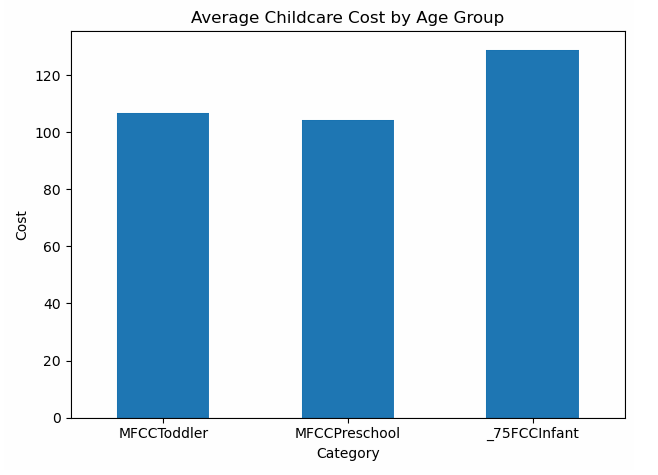
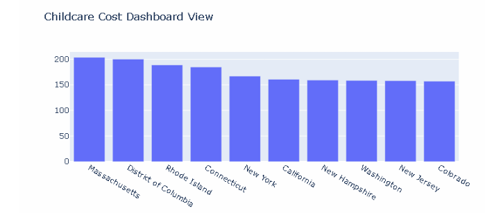

# Childcare Pricing Analysis

## Understanding Cost Trends Through Data Analytics

## Project Overview

Childcare affordability is an important challenge for families and communities. This project analyzes childcare pricing data to identify cost trends, regional differences, and patterns that influence childcare expenses.

## Business Problem

Childcare costs vary significantly depending on geographic location and market conditions.

This analysis explores:

- How childcare prices vary across regions
- Pricing distributions
- Cost differences
- Market trends

## Analytical Approach

The project included:

- Data cleaning
- Exploratory data analysis
- Statistical analysis
- Data visualization

## Visual Analysis

### Childcare Pricing Comparison

### Pricing Distribution

## Tools and Technologies

- Python
- Pandas
- NumPy
- Matplotlib
- Data Visualization

## Skills Demonstrated

- Exploratory Data Analysis
- Statistical Analysis
- Visualization Design
- Business Storytelling

## Business Impact

This project demonstrates how data analytics can reveal affordability trends and support informed decision-making.
